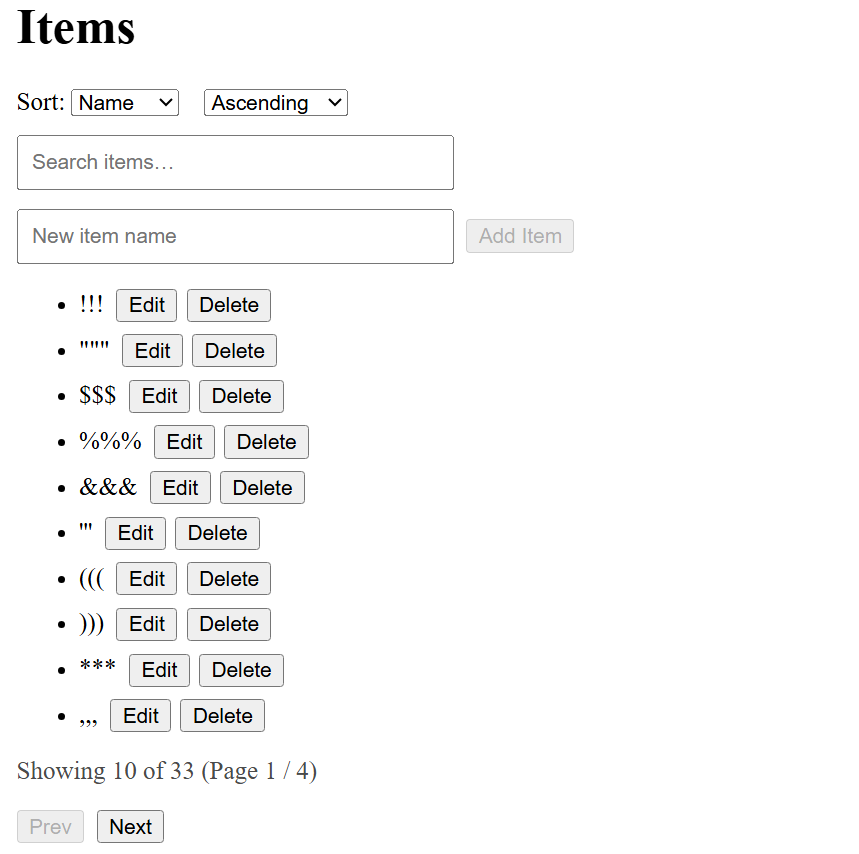
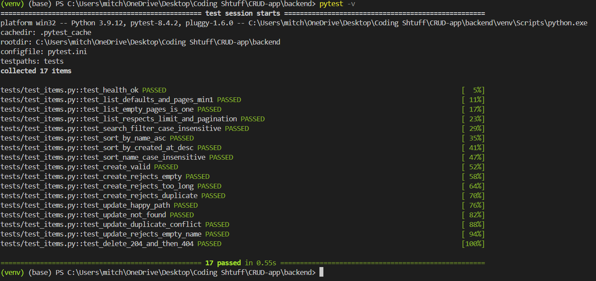
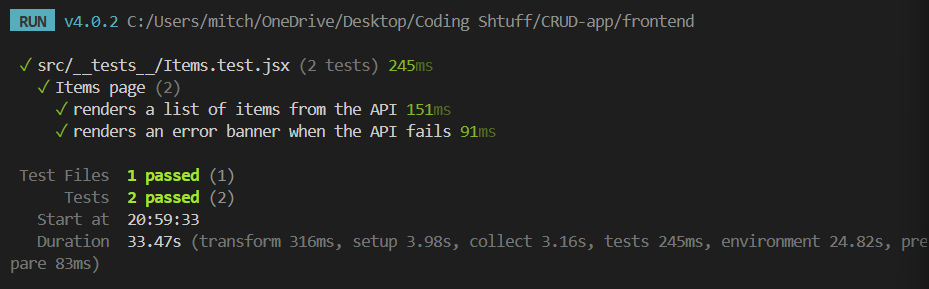
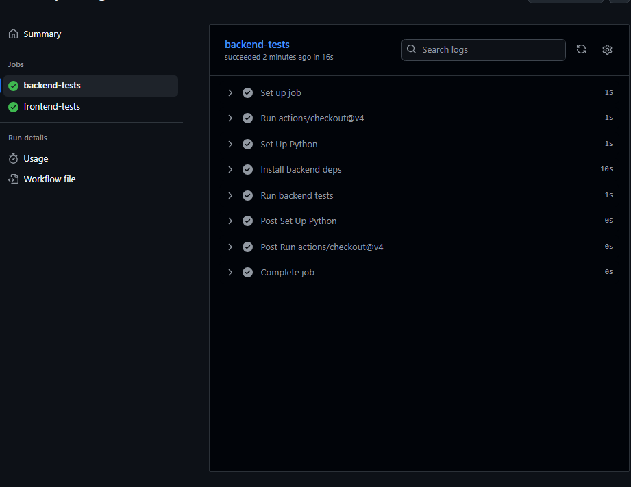
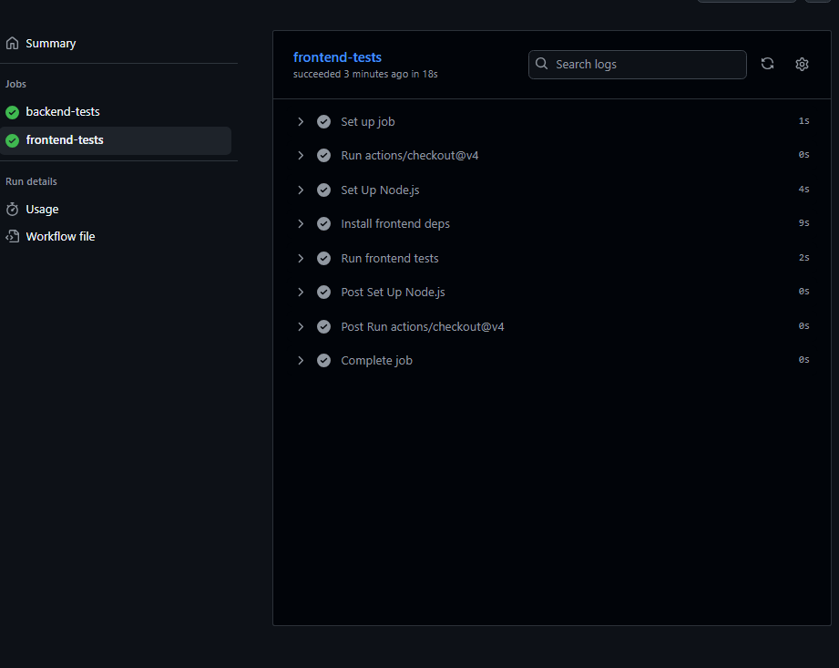

# CRUD App

## 📌 Project Description

Practice project to learn full-stack development with React and Flask.  
Implements Create, Read, Update, and Delete (CRUD) functionality with a database backend.

---

## 🚀 Tech Stack

- **Frontend:** React (JS, JSX, HTML, CSS), TailwindCSS (styling not complete - may just use CSS), Vitest
- **Backend:** Flask (Python), Pytest
- **Database:** SQLAlchemy
- **Other Tools:** Git (CI/CD)

---

## 📂 Features (Work in Progress)

- [✅] React frontend
- [✅] React Router for navigation
- [✅] Backend API (Flask + SQLAlchemy)
- [✅] SQL Database for persistent storage
- [✅] Create/Read/Update/Delete items
- [✅] Filterable/Sortable/Paginated lists
- [✅] Pytest for backend tests
- [✅] Vitest for frontend tests
- [✅] Github workflow included
- [] Authentication (stretch goal)

---

## 🛠️ Installation & Setup

### Installation:

1. Clone the repo:
   ```bash
   git clone https://github.com/MitchBrown532/crud-app.git
   cd crud-app
   ```
2. Install frontend dependencies:
   ```bash
   cd frontend
   npm install
   ```
3. Setup backend:

   ```bash
   cd backend
   pip install -r requirements.txt
   ```

### Start-Up

#### Concurrent Start-Up:

1. Run the start command:
   ```bash
   npm run start:all
   ```

- This command will concurrently run frontend & backend (including intializing the venv for backend). All data from frontend and backend will be color coded and shown in a shared console for ease of life.

#### Front-end Start-up:

1. Navigate to frontend
   ```bash
   cd frontend
   ```
2. Run start-up command:
   ```bash
   npm start
   ```

#### Back-end Start-up:

1. Navigate to frontend
   ```bash
   cd frontend
   ```
2. Start up Virtual Environment (if not already done)
   ```bash
   ./venv/Scripts/Activate
   ```
3. Run start-up command:
   ```bash
   python app.py
   ```

---

## 🔌 API

- GET /api/items?q=&page=&limit=&sort=id|name|created_at&order=asc|desc
- POST /api/items
- PUT /api/items/:id
- DELETE /api/items/:id

---

## 🧪 Tests

For backend tests:

1. Navigate to backend
   ```bash
   cd backend
   ```
2. Run tests
   ```bash
   pytest -v
   ```

- This will run all backend tests and return a verbose report for each test.

For frontend tests: (not yet created)

---

## ⚙️ Tech Decisions

- **Flask Factory Pattern**: The API is created via `create_app()` for clean test isolation, environment-specific config, and easy growth into Blueprints.
- **SQLAlchemy Models + `to_dict()`**: Models control their own JSON shape (stable API contract, easy evolution).
- **Search + Debounce (300ms)**: Reduces pointless network traffic while keeping the UI responsive during typing.
- **URL-Synced State (`q`, `page`, `sort`, `order`)**: Shareable links and refresh-safe views via `useSearchParams`.
- **Sorting Whitelist**: Only known columns (`id`, `name`, `created_at`) are accepted server-side to avoid invalid input/SQL injection vectors.
- **Optimistic Delete**: Instant UI feedback with rollback on failure for a snappy feel.
- **REST Semantics**: `201` on create, `204` on delete, and descriptive 4xx messages for predictable client behavior.
- **Testing Strategy**:
  - **Backend**: Pytest covers CRUD, pagination/search, and sorting.
  - **Frontend**: Lightweight Vitest + React Testing Library smoke tests (list renders, errors render) to guard core flows.

---

## 📸 Screenshots (to add later)







---

## 📜 License

This project is for learning purposes only. Free to use and adapt it.

---
