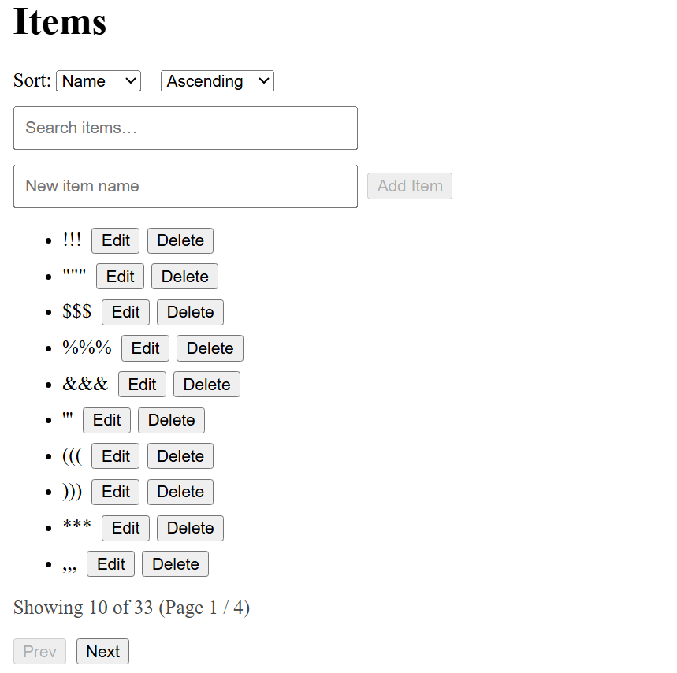
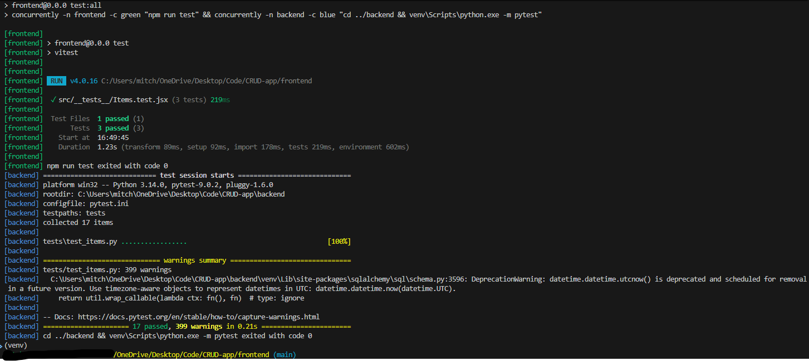
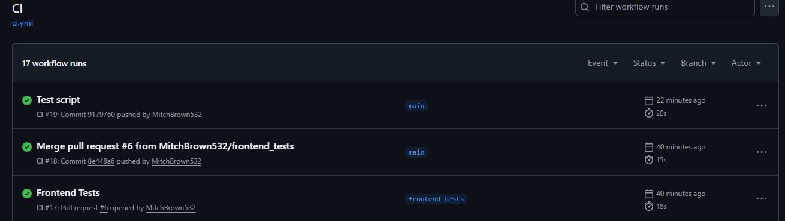
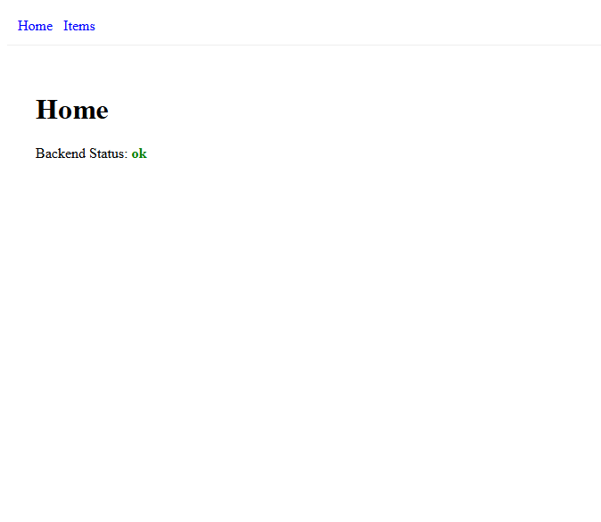
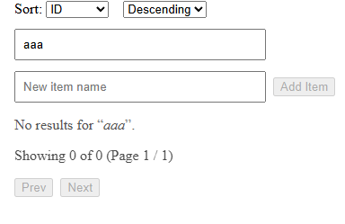
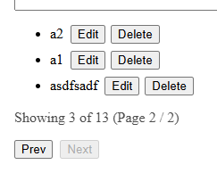
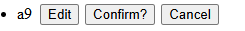

# CRUD App

## 📌 Project Description

Practice project to learn full-stack development with React and Flask.  
Implements full Create, Read, Update, and Delete (CRUD) functionality with a SQL database backend.

---

## 🚀 Tech Stack

- **Frontend:** React (JS, JSX, HTML, CSS), TailwindCSS (styling not complete - may just use CSS), Vitest
- **Backend:** Flask (Python), SQLAlchemy, Pytest
- **Other Tools:** Git, Github Actions (CI/CD)

---

## 📂 Features (Work in Progress)

- [✅] React frontend
- [✅] React Router for navigation
- [✅] Backend API (Flask + SQLAlchemy)
- [✅] Persistent SQL database 
- [✅] CRUD operations: Create, Read, Update, Delete 
- [✅] Filterable, sortable, and paginated lists
- [✅] Pytest for backend tests
- [✅] Vitest for frontend tests
- [✅] Github workflow included
- [❌] Authentication (not implemented)

---

## 🏗️ Architecture

Simple full-stack architecture:

```
Frontend (React/Vite) <--> Backend (Flask) <--> Database (Postgres/SQLite)
```

- Frontend: Single-page app with React Router, API calls via fetch.
- Backend: REST API with Flask, SQLAlchemy ORM.
- Database: Managed Postgres in production, SQLite for development.

---

## 🔌 API Routes

| Method | Endpoint | Description | Body/Params |
|--------|----------|-------------|-------------|
| GET | /api/health | Health check | - |
| GET | /api/items | List items with pagination/filtering | Query: q, page, limit, sort, order |
| POST | /api/items | Create item | { "name": string } |
| PUT | /api/items/:id | Update item | { "name": string } |
| DELETE | /api/items/:id | Delete item | - |

---

## 🔐 Auth Flow

No authentication implemented. All endpoints are public.

---

## 🧪 Testing Strategy

- **Backend**: Pytest for unit tests (models) and integration tests (API endpoints). Tests run in isolated DB.
- **Frontend**: Vitest for component tests (e.g., ItemRow). Uses jsdom for DOM simulation.
- **CI/CD**: GitHub Actions runs all tests on push/PR. Includes linting and build checks.

---

## ⚖️ Tradeoffs

- **No Authentication**: Kept simple to focus on CRUD. Can be added later with JWT.
- **Offset Pagination**: Used offset-based pagination for simplicity. Cursor-based would be better for large datasets but adds complexity.
- **No Request Validation**: No schema validation on inputs. Relies on manual checks.
- **No Centralized Error Handling**: Errors handled ad-hoc in routes. Could be improved with Flask error handlers.
- **SQLite in Dev**: Easy setup, but Postgres in prod for scalability.

---

## 🚀 Deployment

### Backend (Render)
1. Create Render account at render.com.
2. Create a Postgres database in Render.
3. Create a Web Service from your GitHub repo (set root to `backend`).
4. Set build command: `pip install -r requirements.txt`
5. Set start command: `gunicorn wsgi:app`
6. Add env var: `DATABASE_URL` = your Postgres URL.

### Frontend (Vercel)
1. Create Vercel account at vercel.com.
2. Import project from GitHub (set root to `frontend`).
3. Set build command: `npm run build`
4. Add env var: `VITE_API_URL` = your Render backend URL.

### Live Demo
After deployment, the frontend URL will be your live demo.

---

## 🛠️ Installation & Setup

### Installation:

1. Clone the repo:
   ```bash
   git clone https://github.com/MitchBrown532/crud-app.git
   cd crud-app
   ```
2. Install frontend dependencies:
   ```bash
   cd frontend
   npm install
   ```
3. Setup backend:

   ```bash
   cd ../backend
   pip install -r requirements.txt
   ```
4. Create ENV

   ```bash
   cd ../frontend
   touch .env
   ```
   - Add the following line to `.env `:
   ```bash
   VITE_API_URL= http://127.0.0.1:5001
   ```
   (Replace with your own back end port if different.)

### Start-Up

#### Concurrent Start-Up:

1. Run the start command:
   ```bash
   cd frontend
   npm run start:all
   ```

- This command will concurrently run frontend & backend (including intializing the venv for backend). All data from frontend and backend will be color coded and shown in a shared console for ease of life.

#### Front-end Start-up:

1. Run start-up command:
   ```bash
   cd frontend
   npm run start:frontend
   ```

#### Back-end Start-up:

1. Run start-up command:
   ```bash
   cd frontend
   npm run start:backend
   ```

---

## 🔌 API Endpoints

- GET /api/items?q=&page=&limit=&sort=id|name|created_at&order=asc|desc
- POST /api/items
- PUT /api/items/:id
- DELETE /api/items/:id

---

## 🧪 Tests

For backend tests:

1. Navigate to backend 
   ```bash
   cd backend
   ```
2. Run tests
   ```bash
   pytest -v
   ```

- This will run all backend tests and return a verbose report for each test.

For frontend tests:

1. Navigate to frontend
   ```bash
   cd frontend
   ```
2. Run tests
   ```bash
   npm run test
   ```
- This will run all frontend tests and return a verbose report for each test.

---

## ⚙️ Tech Decisions

- **Flask Factory Pattern**: The API is created via `create_app()` for clean test isolation and environment configs.
- **SQLAlchemy Models + `to_dict()`**: Models control JSON structure for predictable API.
- **Search + Debounce (300ms)**: Reduces pointless network traffic while keeping the UI responsive during typing.
- **URL-Synced State (`q`, `page`, `sort`, `order`)**: Shareable, refresh-safe views
- **Sorting Whitelist**: Only known columns (`id`, `name`, `created_at`) are accepted server-side to avoid invalid input/SQL injection vectors.
- **Optimistic Delete**: Instant UI feedback with rollback on failure for a snappy feel.
- **REST Semantics**: `201` for create, `204` for delete, descriptive `4xx` errors
- **Testing Strategy**:
  - **Backend**: Pytest covers CRUD, pagination/search, and sorting.
  - **Frontend**: Lightweight Vitest + React Testing Library smoke tests (list renders, errors render, etc.).

---

## 📸 Screenshots











---

## 📜 License

This project is for learning purposes only. Free to use and adapt it.

---

## 📝 Project Status

- [✅] Core CRUD features complete
- [✅] Filtering, sorting, pagination complete
- [⬜] Add styling
- [⬜] Auth and advanced features stretch goals